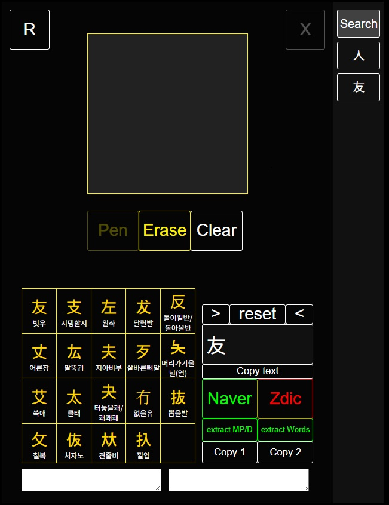
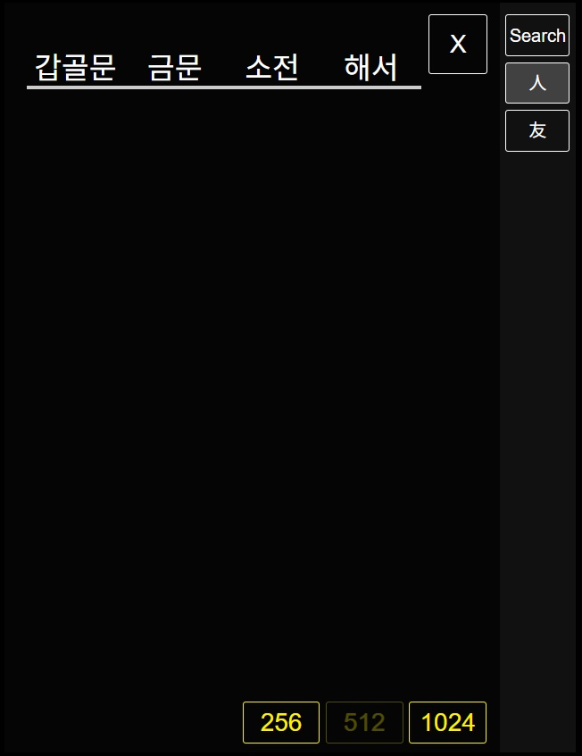

# 탭 기반 멀티 검색 UI 구현

단일 정적 페이지 방식에서 동적 탭 생성 방식으로 전면 전환.

## 변경사항

- `public/index.html`: 최소 구조로 축소 — `#mainTabComponent` + 빈 `.tab-content` / `.tab-buttons` 영역만 유지
- `public/js/mainScript.js`: ES 모듈(`type="module"`) 방식으로 변경, `create_searchTab()` 호출로 초기 탭 생성
- `createORremoveTabs/createSearchTab.js` (신규): Search 탭 전체 HTML + 이벤트를 동적 생성
  - Replicate 버튼: 새 Search 탭 추가
  - Cancel 버튼: 현재 탭 제거 (최소 1개 유지, 2개 이상일 때만 활성화)
  - Zdic 버튼: 서버 요청 후 콘솔 출력 (차탭 미구현)
- `createORremoveTabs/removeSearchTab.js` (신규): 탭 제거 및 인접 탭 활성화, index 재배치

## 화면

<탭 기반 UI - Search 탭>

<Replicate로 탭 여러 개 생성 (Cancel 버튼 활성화 상태)>

